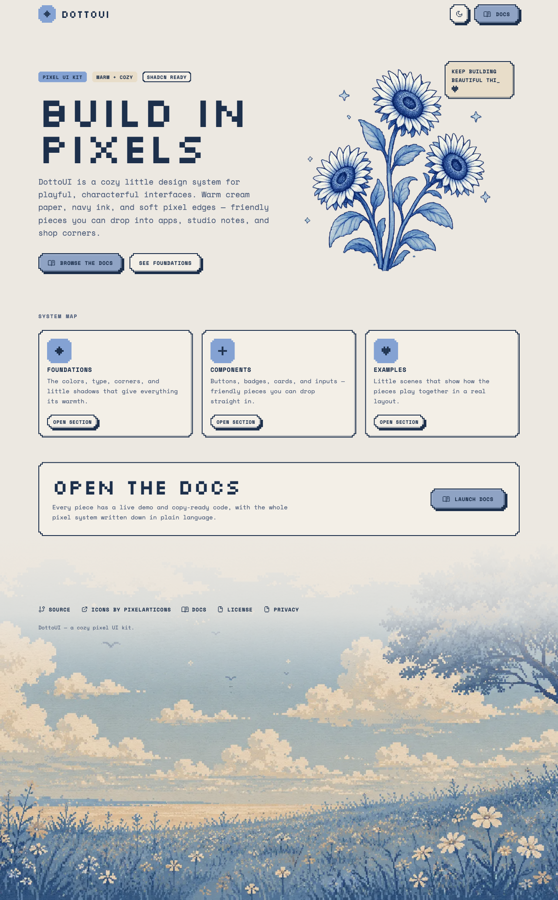

<div align="center">


# DottoUI

**A cozy, pixel-art design system for React — warm cream paper, navy ink, stepped corners.**
Drop-in components distributed through a [shadcn](https://ui.shadcn.com)-compatible registry.

[](https://github.com/yamustofa/dotto-ui/actions/workflows/deploy.yml)
[](./LICENSE)


[**Docs**](https://yamustofa.github.io/dotto-ui/) ·
[**Components**](https://yamustofa.github.io/dotto-ui/components/button/) ·
[**Foundations**](https://yamustofa.github.io/dotto-ui/foundations/colors/)



</div>

## Why DottoUI

- 🎨 **A real system, not a snippet dump** — shared tokens (color, type, corners, shadows) and a documented pixel utility layer keep every component visually consistent.
- 📋 **Copy-paste ownership, via the shadcn registry** — components are added straight into _your_ codebase. No runtime dependency, no lock-in, yours to edit.
- ♿ **Accessible primitives** — built on [Radix UI](https://www.radix-ui.com/) and native semantics (focus rings, labels, keyboard support).
- 🌗 **Light & dark** — every token ships both themes; surfaces follow the OS or your app's preference.
- 🧩 **TypeScript-first** — strict types and `class-variance-authority` variants for predictable, autocompleted APIs.
- 🪙 **MIT licensed, free icons** — [Pixelarticons](https://pixelarticons.com) (MIT) for the iconography.

Live docs with a runnable demo and copy-ready code for every component:
**<https://yamustofa.github.io/dotto-ui/>**

## Quick start

DottoUI installs into any React project already set up for shadcn/ui
(React 19, Tailwind v4, and a `components.json`). New project? Follow the
[shadcn installation guide](https://ui.shadcn.com/docs/installation) first.

**1. Add the core tokens & utilities** (the shared pixel layer — install this once):

```bash
npx shadcn@latest add https://yamustofa.github.io/dotto-ui/r/dotto-core.json
```

**2. Add the components you need:**

```bash
npx shadcn@latest add https://yamustofa.github.io/dotto-ui/r/button.json
npx shadcn@latest add https://yamustofa.github.io/dotto-ui/r/badge.json
```

**3. Use them:**

```tsx
import { Button } from "@/components/ui/button"

export function Example() {
  return (
    <div className="flex gap-4">
      <Button>browse the docs</Button>
      <Button variant="outline">see foundations</Button>
    </div>
  )
}
```

## Components

Install any item with `npx shadcn@latest add https://yamustofa.github.io/dotto-ui/r/<name>.json`.

| Name | Type | Description |
| --- | --- | --- |
| `dotto-core` | tokens | Color/type tokens + the pixel utility layer (`pixel-corner`, `pixel-shadow`, …). Install first. |
| `utils` | lib | The `cn()` class-merge helper. |
| `button` | ui | Bordered pixel button with offset shadow and sink-on-press. |
| `badge` | ui | Small uppercase mono chip with a single-step notch. |
| `card` | ui | Cream surface card with header/content slots. |
| `input` · `textarea` · `label` · `checkbox` | ui | Form primitives. |
| `pixel-glyph` | component | Pure-CSS pixel shapes (heart, sparkle, diamond…). |
| `icon-tile` | component | Framed tile for housing an icon or glyph. |
| `sticky-note` | component | Tactile note surface for callouts. |

Full props, variants, and live demos are in the [component docs](https://yamustofa.github.io/dotto-ui/components/button/).

## Theming

Tokens live in `src/styles/_dotto-core.css` (mapped into Tailwind v4 via
`@theme inline`). Override the CSS variables in your own `:root` /
`.dark` to retheme — `--background`, `--foreground`, `--primary`,
`--border`, `--pixel-shadow-color`, and the `--font-*` families. See
[Foundations → Colors](https://yamustofa.github.io/dotto-ui/foundations/colors/).

## Local development

```bash
npm install
npm run dev               # docs + landing at http://localhost:4321/dotto-ui/
npm run build             # type-check (astro check) + static build to dist/
npm run registry:build    # regenerate public/r/*.json from registry.json
```

- `src/components/ui` — the shadcn-style UI primitives.
- `src/components/dotto` — DottoUI-specific primitives (glyph, icon tile, sticky note).
- `src/content/docs` — the Starlight documentation pages.
- `src/styles/_dotto-core.css` — shared tokens + pixel utility layer.
- `registry.json` → `public/r/*.json` — the shadcn registry source and generated output.

## Contributing

Issues and PRs are welcome. Please run `npm run build` (it includes
`astro check`) before opening a PR so types and the docs build stay green.

## License

[MIT](./LICENSE) © Habib Mustofa. Icons by [Pixelarticons](https://pixelarticons.com) (MIT).

## Credits

Built with [Astro](https://astro.build) + [Starlight](https://starlight.astro.build),
[React](https://react.dev), [Tailwind CSS v4](https://tailwindcss.com), and the
[shadcn/ui](https://ui.shadcn.com) registry conventions.
